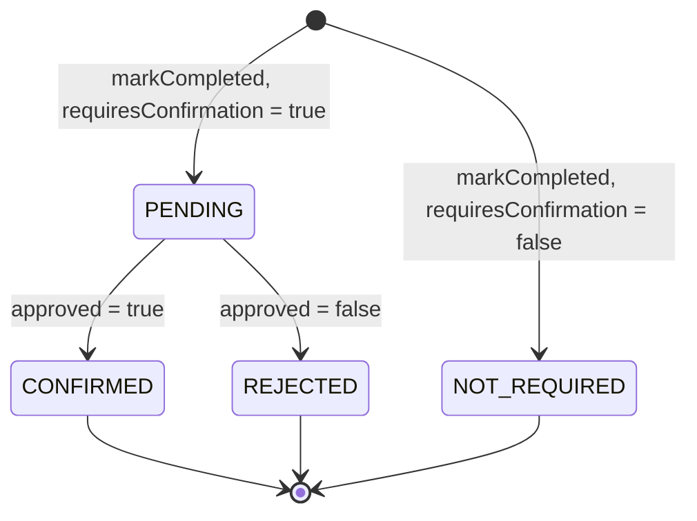
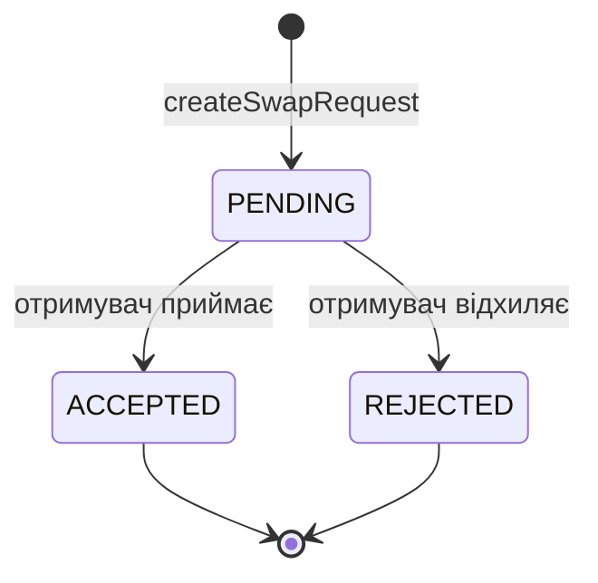

# Orchestrate

Застосунок для справедливого розподілу побутових обов'язків між мешканцями спільного домогосподарства:
мешканці добровільно приєднуються до обов'язків, відповідальний на поточний цикл визначається ротацією,
виконання може потребувати підтвердження, а чергу можна обміняти з іншим учасником.

Цей документ описує **статуси, бізнес-правила та скінченні автомати (FSM)** двох сутностей:

- [`ConfirmationStatus`](#1-confirmationstatus--підтвердження-виконання) — статус підтвердження виконання обов'язку;
- [`SwapRequestStatus`](#2-swaprequeststatus--запит-на-обмін-чергою) — статус запиту на обмін чергою.

## Зміст

- [Загальний підхід](#загальний-підхід)
- [1. ConfirmationStatus](#1-confirmationstatus--підтвердження-виконання)
- [2. SwapRequestStatus](#2-swaprequeststatus--запит-на-обмін-чергою)
- [3. Household і User — домогосподарства, членство, права](#3-household-і-user--домогосподарства-членство-права)
- [Обробка помилок](#обробка-помилок)
- [Де що лежить у коді](#де-що-лежить-у-коді)
- [Тести](#тести)
- [Як змінювати автомат](#як-змінювати-автомат)
- [Відомі обмеження](#відомі-обмеження)

---

## Загальний підхід

Життєвий цикл кожної сутності змодельовано як скінченний автомат: сутність завжди перебуває в одному зі
скінченної множини станів, а зміна стану дозволена лише за наперед визначеними правилами.

1. **Граф переходів живе в домені.** Кожен enum має метод `canTransitionTo(next)`, реалізований через
   `switch`-вираз **без `default`**. Якщо додати нове значення enum'а, проєкт перестане компілюватися,
   доки для нього не буде описано переходи.
2. **Сервіс перевіряє перехід до збереження.** Перед тим як записати новий статус (і перед будь-якими
   побічними ефектами: ротацією, публікацією події), сервіс викликає `canTransitionTo`.
3. **Порушення = типізований виняток.** Недозволений перехід кидає `InvalidStateTransitionException`
   (для кожного автомата — свій спадкоємець), який `GlobalExceptionHandler` перетворює на
   **HTTP 422 Unprocessable Content** із тілом `ProblemDetail` (RFC 9457).
4. **Початковий стан — не перехід.** Статус, з яким запис створюється, задається бізнес-логікою створення;
   `canTransitionTo` описує лише зміни вже існуючого запису.
5. **Переходи «в себе» заборонені.** `PENDING → PENDING`, `CONFIRMED → CONFIRMED` тощо недозволені:
   повторна дія над уже розглянутим записом — це помилка, а не «ідемпотентний успіх».

---

## 1. ConfirmationStatus — підтвердження виконання

`ConfirmationStatus` — поле `status` запису `ChoreCompletion` (факт виконання обов'язку одним із учасників).

### Стани

| Стан | Значення | Початковий | Кінцевий |
|---|---|:-:|:-:|
| `NOT_REQUIRED` | Обов'язок не потребує підтвердження; виконання завершене одразу | так | так |
| `PENDING` | Виконавець відмітив виконання, очікується рішення підтверджувача | так | ні |
| `CONFIRMED` | Виконання підтверджено | ні | так |
| `REJECTED` | Підтвердження відхилено | ні | так |

### Діаграма



### Матриця переходів

Рядок — поточний стан, стовпець — цільовий. ✅ — дозволено, ❌ — заборонено (`InvalidConfirmationStatusException`).

| з \ у | `NOT_REQUIRED` | `PENDING` | `CONFIRMED` | `REJECTED` |
|---|:-:|:-:|:-:|:-:|
| **`NOT_REQUIRED`** | ❌ | ❌ | ❌ | ❌ |
| **`PENDING`** | ❌ | ❌ | ✅ | ✅ |
| **`CONFIRMED`** | ❌ | ❌ | ❌ | ❌ |
| **`REJECTED`** | ❌ | ❌ | ❌ | ❌ |

Єдиний дозволений перехід — розгляд запису у стані `PENDING`. Усі три інші стани кінцеві.

### Як виникають статуси та що відбувається при переході

| Момент | Статус запису | Ініціатор і API | Наслідки |
|---|---|---|---|
| Створення запису, обов'язок **потребує** підтвердження | `PENDING` | Поточний відповідальний, `POST /api/v1/chores/{choreId}/completions` | Ротація **не** рухається |
| Створення запису, обов'язок **не потребує** підтвердження | `NOT_REQUIRED` | Те саме | Ротація одразу переходить до наступного учасника |
| `PENDING → CONFIRMED` | `CONFIRMED` | Підтверджувач, `POST .../completions/{completionId}/confirmation` з `approved = true` | Ротація переходить до наступного учасника |
| `PENDING → REJECTED` | `REJECTED` | Те саме з `approved = false` | Ротація **не** змінюється |

### Бізнес-правила

| № | Правило |
|---|---|
| BR-C1 | Відмітити виконання може лише поточний відповідальний за цикл (`NOT_CURRENT_RESPONSIBLE`) і лише коли у групи є відповідальний (`NO_ACTIVE_ASSIGNMENT`). |
| BR-C2 | Початковий статус визначається атрибутом обов'язку `requiresConfirmation`: `true` → `PENDING`, `false` → `NOT_REQUIRED`. |
| BR-C3 | Рішення (`CONFIRMED` / `REJECTED`) можна ухвалити **лише** для запису у стані `PENDING`. Записи `NOT_REQUIRED`, `CONFIRMED`, `REJECTED` незмінні. |
| BR-C4 | Рішення **не може** ухвалювати сам виконавець (`SELF_CONFIRMATION_NOT_ALLOWED`). Належність підтверджувача до групи виконання цього обов'язку не вимагається. |
| BR-C5 | Підтверджений запис (`CONFIRMED`) завершує цикл: відповідальним стає наступний учасник групи за ротацією. |
| BR-C6 | Відхилений запис (`REJECTED`) цикл не завершує: відповідальним лишається той самий учасник. Він може відмітити виконання знову — це створює **новий** запис `ChoreCompletion` (`PENDING`), а відхилений лишається в історії. |
| BR-C7 | Кінцевий статус не можна змінити повторним запитом: повторне підтвердження, повторне відхилення, а також «передумав» (`REJECTED → CONFIRMED` і навпаки) дають `422`. |

Кінцеві статуси незмінні, тому статистика участі (агрегувальні запити над `ChoreCompletion`) не «пливе»
заднім числом.

---

## 2. SwapRequestStatus — запит на обмін чергою

`SwapRequestStatus` — поле `status` запису `SwapRequest`: пропозиція одного учасника групи виконання
обов'язку обмінятися чергою з іншим учасником тієї самої групи.

### Стани

| Стан | Значення | Початковий | Кінцевий |
|---|---|:-:|:-:|
| `PENDING` | Запит створено, очікується відповідь отримувача | так | ні |
| `ACCEPTED` | Отримувач погодився; обмін виконується | ні | так |
| `REJECTED` | Отримувач відмовив; черга не змінюється | ні | так |

### Діаграма



### Матриця переходів

| з \ у | `PENDING` | `ACCEPTED` | `REJECTED` |
|---|:-:|:-:|:-:|
| **`PENDING`** | ❌ | ✅ | ✅ |
| **`ACCEPTED`** | ❌ | ❌ | ❌ |
| **`REJECTED`** | ❌ | ❌ | ❌ |

Так само, як і в `ConfirmationStatus`, єдиний дозволений перехід — розгляд запису у початковому стані.
Зокрема, повернути запит у `PENDING` не можна, а повторна відповідь тим самим статусом
(`ACCEPTED → ACCEPTED`) — помилка.

### Як виникають статуси та що відбувається при переході

| Момент | Статус запису | Ініціатор і API | Наслідки |
|---|---|---|---|
| Створення запиту | `PENDING` | Учасник групи, `POST /api/v1/chores/{choreId}/swap-requests` | Нічого не змінюється в черзі |
| `PENDING → ACCEPTED` | `ACCEPTED` | Отримувач, `PATCH /api/v1/chores/{choreId}/swap-requests/{requestId}` зі `status = ACCEPTED` | Публікується `TurnSwapRequestedEvent` → модуль `chore` виконує `swapTurns`: два учасники міняються місцями в черзі; якщо відповідальним був ініціатор, відповідальність переходить до отримувача в тому самому циклі |
| `PENDING → REJECTED` | `REJECTED` | Отримувач, той самий `PATCH` зі `status = REJECTED` | Подія **не** публікується, черга не змінюється |

### Бізнес-правила

| № | Правило |
|---|---|
| BR-S1 | Ініціатор і отримувач мають бути різними людьми (`INVALID_SWAP_REQUEST_RECIPIENT`). |
| BR-S2 | І ініціатор, і отримувач мають бути учасниками групи виконання саме цього обов'язку (`NOT_CHORE_PARTICIPANT`). |
| BR-S3 | Між тією самою парою (ініціатор → отримувач) для одного обов'язку може бути лише один запит у стані `PENDING` (`SWAP_REQUEST_ALREADY_EXISTS`). Після переходу запиту в кінцевий стан можна створити новий. |
| BR-S4 | Відповісти на запит може лише його **отримувач** (`NOT_SWAP_REQUEST_RECEIVER`, HTTP 403). Ця перевірка виконується **до** перевірки автомата. |
| BR-S5 | Запит має належати саме тому обов'язку, що вказаний у шляху; інакше він «не знайдений» (`SWAP_REQUEST_NOT_FOUND`). |
| BR-S6 | Відповісти можна лише на запит у стані `PENDING`; `ACCEPTED` і `REJECTED` незмінні. |
| BR-S7 | Тільки перехід `PENDING → ACCEPTED` змінює чергу й публікує подію. Невдала спроба (`422`) подій не породжує. |

---

## 3. Household і User — домогосподарства, членство, права

Модуль `user` зберігає профілі користувачів. Модуль `household` відповідає за домогосподарства, членство
(`Membership`), права учасників (`MembershipPermission`) і коди запрошення (`InvitationCode`).
`household` залежить від `user` лише через `UserClient` (`user/client`), а `user` про `household` не знає,
тому циклу між модулями немає. Той, хто виконує дію, визначається через `CurrentUserProvider`, як і в модулі `swap`.

Один `User` може бути учасником багатьох `Household`: кожне членство — окремий запис `Membership`
(`householdId`, `userId`, `permissions`, `joinedAt`).

### API

| Метод | Шлях | Хто може | Що робить |
|---|---|---|---|
| POST | `/api/v1/users` | будь-хто | Реєстрація користувача (`displayName`, `email`) → 201 |
| GET | `/api/v1/users`, `/api/v1/users/{userId}` | будь-хто | Список / один користувач |
| GET | `/api/v1/users/{userId}/households` | будь-хто | Усі доми користувача з ознакою `owner` і правами |
| POST | `/api/v1/households` | зареєстрований користувач | Створити дім (`name`); творець стає власником → 201 |
| GET | `/api/v1/households/{householdId}` | учасник | Дім з `ownerId` |
| DELETE | `/api/v1/households/{householdId}` | власник | Видалити дім разом із членствами й кодом → 204 |
| POST | `/api/v1/households/{householdId}/ownership-transfer` | власник | Передати власність (`newOwnerUserId`) |
| GET | `/api/v1/households/{householdId}/members[/{userId}]` | учасник | Учасники / один учасник |
| DELETE | `/api/v1/households/{householdId}/members/{userId}` | сам учасник або `MANAGE_MEMBERS` | Вийти з дому (свій `userId`) або видалити іншого учасника → 204 |
| PUT | `/api/v1/households/{householdId}/members/{userId}/permissions` | `MANAGE_MEMBERS` | Замінити набір прав (`permissions`) |
| POST | `/api/v1/households/{householdId}/invitation-code` | `INVITE_MEMBERS` | Згенерувати код; попередній код перестає діяти → 201 |
| GET / DELETE | `/api/v1/households/{householdId}/invitation-code` | `INVITE_MEMBERS` | Переглянути активний код / відкликати його |
| POST | `/api/v1/households/join` | зареєстрований користувач | Приєднатися за кодом (`code`) → 201 |

### MembershipPermission

| Право | Що дозволяє |
|---|---|
| `MANAGE_CHORES` | Керувати обов'язками дому (для модуля `chore`, поки не перевіряється) |
| `CONFIRM_COMPLETIONS` | Підтверджувати виконання (для модуля `chore`, поки не перевіряється) |
| `INVITE_MEMBERS` | Створювати, переглядати й відкликати код запрошення |
| `MANAGE_MEMBERS` | Видаляти учасників і змінювати їхні права |

Власник завжди має всі права: вони зберігаються в його `Membership` і змінити їх не можна. Новий учасник,
який приєднався за кодом, отримує `CONFIRM_COMPLETIONS`. Модуль `chore` може перевіряти права через
`HouseholdClient` (`household/client`: `isMember`, `hasPermission`).

### Бізнес-правила

| № | Правило |
|---|---|
| BR-H1 | У дому рівно один власник — поле `ownerId`. Власник завжди є учасником. Задати `ownerId` у тілі запиту не можна: власником стає творець. |
| BR-H2 | Створити дім або приєднатися до нього може лише зареєстрований `User` (`USER_NOT_FOUND`). |
| BR-H3 | Передати власність може лише власник (`NOT_HOUSEHOLD_OWNER`, 403) і лише іншому учаснику цього дому (`OWNERSHIP_TRANSFER_TO_SELF`, 400; `MEMBERSHIP_NOT_FOUND`, 404). Новий власник отримує всі права, колишній лишається учасником зі своїми правами. |
| BR-H4 | Власник не може вийти, поки в домі є інші учасники: спершу передача власності (`OWNER_MUST_TRANSFER_OWNERSHIP`, 409). |
| BR-H5 | Дім без власника не існує: якщо власник — останній учасник і виходить, дім видаляється разом із членствами та кодом запрошення. Власник може й явно видалити дім. |
| BR-H6 | Видаляти інших учасників може власник або учасник з `MANAGE_MEMBERS` (`MISSING_PERMISSION`, 403). Власника видалити не можна (`CANNOT_REMOVE_OWNER`, 409). |
| BR-H7 | Змінювати права може власник або учасник з `MANAGE_MEMBERS`. Права власника незмінні (`OWNER_PERMISSIONS_IMMUTABLE`, 409); власні права змінювати не можна, щоб ніхто не розширив собі доступ (`SELF_PERMISSION_CHANGE_NOT_ALLOWED`, 409). |
| BR-H8 | Код запрошення: 8 символів без схожих `0/O`, `1/I`, діє 7 днів і може використовуватися багато разів до завершення строку. У дому одночасно лише один активний код: новий заміняє попередній. Регістр і пробіли під час введення не важливі. |
| BR-H9 | Приєднання за кодом: код має існувати (`INVITATION_CODE_NOT_FOUND`, 404) і не бути простроченим (`INVITATION_CODE_EXPIRED`, 409); користувач ще не має бути учасником (`ALREADY_HOUSEHOLD_MEMBER`, 409). |
| BR-H10 | Дані дому та список учасників бачать лише учасники (`NOT_HOUSEHOLD_MEMBER`, 403). |
| BR-U1 | Email користувача унікальний без урахування регістру та зберігається в нижньому регістрі (`EMAIL_ALREADY_TAKEN`, 409). |

Порядок перевірок у `HouseholdServiceImpl`: дім існує (404) → поточний користувач є учасником (403) →
потрібне право чи роль власника (403) → бізнес-правило (400/409) → збереження.

---

## Обробка помилок

Усі відповіді про помилки мають формат `ProblemDetail`; код помилки — у полі `code`.

| Ситуація | Виняток | `code` | HTTP |
|---|---|---|:-:|
| Недозволений перехід `ConfirmationStatus` | `InvalidConfirmationStatusException` | `INVALID_CONFIRMATION_STATUS` | 422 |
| Недозволений перехід `SwapRequestStatus` | `InvalidSwapRequestStatusException` | `INVALID_SWAP_REQUEST_STATUS` | 422 |
| Підтверджувач збігається з виконавцем | `BusinessRuleViolationException` | `SELF_CONFIRMATION_NOT_ALLOWED` | 409 |
| Запис виконання не знайдено (або він належить іншому обов'язку) | `ResourceNotFoundException` | `COMPLETION_NOT_FOUND` | 404 |
| Відповідає не отримувач запиту | `NotSwapRequestReceiverException` | `NOT_SWAP_REQUEST_RECEIVER` | 403 |
| Запит на обмін не знайдено | `SwapRequestNotFoundException` | `SWAP_REQUEST_NOT_FOUND` | 404 |
| Дубль запиту `PENDING` | `DuplicateSwapRequestException` | `SWAP_REQUEST_ALREADY_EXISTS` | 409 |
| Ініціатор = отримувач | `InvalidSwapRequestRecipientException` | `INVALID_SWAP_REQUEST_RECIPIENT` | 400 |
| Хтось із сторін не є учасником обов'язку | `NotChoreParticipantException` | `NOT_CHORE_PARTICIPANT` | 400 |

Приклад відповіді на недозволений перехід:

```http
HTTP/1.1 422
Content-Type: application/problem+json

{
  "type": "https://orchestrate.example.com/problems/invalid-state-transition",
  "title": "Invalid state transition",
  "status": 422,
  "detail": "Illegal state transition for swap request '3f2b…' from ACCEPTED to REJECTED",
  "instance": "/api/v1/chores/11111111-1111-1111-1111-111111111111/swap-requests/3f2b…",
  "timestamp": "…",
  "code": "INVALID_SWAP_REQUEST_STATUS"
}
```

### Порядок перевірок у сервісі

Порядок важливий: автомат перевіряється **після** пошуку та перевірки прав і **до** збереження й побічних ефектів.

`ChoreService.decideConfirmation`:

1. Обов'язок існує (`404`).
2. Запис виконання існує й належить цьому обов'язку (`404`).
3. **Перехід дозволений — `canTransitionTo` (`422`).**
4. Підтверджувач ≠ виконавець (`409`).
5. Збереження нового статусу.
6. Якщо `approved` — ротація на наступного учасника.

`SwapRequestService.respondToSwapRequest`:

1. Запит існує (`404`).
2. Запит належить цьому обов'язку (`404`).
3. Поточний користувач — отримувач (`403`).
4. **Перехід дозволений — `canTransitionTo` (`422`).**
5. Збереження нового статусу.
6. Якщо `ACCEPTED` — публікація `TurnSwapRequestedEvent`.

---

## Де що лежить у коді

Шляхи наведено відносно `src/main/java/genius/project/orchestrate/`.

| Що | Де |
|---|---|
| `ConfirmationStatus` і `canTransitionTo` | `chore/ConfirmationStatus.java` |
| Guard для `ConfirmationStatus` | `chore/internal/ChoreServiceImpl.java` → `decideConfirmation` |
| Виняток `InvalidConfirmationStatusException` | `chore/exception/InvalidConfirmationStatusException.java` |
| `SwapRequestStatus` і `canTransitionTo` | `swap/SwapRequestStatus.java` |
| Guard для `SwapRequestStatus` | `swap/internal/SwapRequestServiceImpl.java` → `respondToSwapRequest` |
| Виняток `InvalidSwapRequestStatusException` | `swap/exception/InvalidSwapRequestStatusException.java` |
| Спільна база `InvalidStateTransitionException` | `common/exception/InvalidStateTransitionException.java` |
| Відображення в HTTP 422 | `common/exception/GlobalExceptionHandler.java` → `handleInvalidStateTransition` |

Реалізація `canTransitionTo` (на прикладі `SwapRequestStatus`):

```java
public boolean canTransitionTo(SwapRequestStatus next) {
    return switch (this) {
        case PENDING -> next == ACCEPTED || next == REJECTED;
        case ACCEPTED, REJECTED -> false;
    };
}
```

Guard у сервісі:

```text
SwapRequestStatus currentStatus = existing.status();
SwapRequestStatus targetStatus = request.status();
if (!currentStatus.canTransitionTo(targetStatus)) {
    throw new InvalidSwapRequestStatusException(requestId, currentStatus, targetStatus);
}
// лише тепер — збереження та побічні ефекти
```

---

## Тести

Шляхи наведено відносно `src/test/java/genius/project/orchestrate/`.

| Тест | Що перевіряє |
|---|---|
| `chore/ConfirmationStatusTest` | Усі 16 пар `ConfirmationStatus × ConfirmationStatus` збігаються з матрицею вище; матриця охоплює всі значення enum'а; перехід у `null` заборонений |
| `swap/SwapRequestStatusTest` | Те саме для 9 пар `SwapRequestStatus × SwapRequestStatus` |
| `chore/internal/ChoreServiceImplTest` → `DecideConfirmation` | Guard у сервісі: `CONFIRMED`, `REJECTED`, `NOT_REQUIRED` не можна розглянути повторно; після відмови нічого не зберігається і ротація не рухається |
| `swap/internal/SwapRequestServiceImplTest` → `RespondToSwapRequest` | Guard у сервісі: з кінцевих станів і з `PENDING` у `PENDING` — виняток; подія не публікується |
| `chore/ChoreCompletionControllerTest`, `swap/SwapRequestControllerTest` | Недозволений перехід повертає `422` і `code` у `ProblemDetail` |

Матриці в тестах і в цьому файлі мають збігатися: якщо змінюєте одну — змінюйте й іншу.

---

## Як змінювати автомат

1. Додайте значення в enum — проєкт не скомпілюється, доки `switch` у `canTransitionTo` не оновлено.
2. Опишіть у `canTransitionTo`, куди можна перейти з нового стану і які стани ведуть у нього.
3. Оновіть матрицю й діаграму в цьому файлі та матрицю `ALLOWED` у відповідному `*StatusTest`.
4. Якщо змінилися побічні ефекти переходу — оновіть таблицю «Як виникають статуси» і порядок перевірок у сервісі.

---

## Відомі обмеження

- **Household: немає атомарності багатокрокових змін.** Передача власності, вихід останнього учасника
  та перевірка унікальності email чи коду запрошення виконуються кількома окремими зверненнями до
  in-memory сховища. З появою БД це закривається транзакцією та унікальними індексами.
- **Household: `CurrentUserProvider` — заглушка.** Вона завжди повертає `00000000-0000-0000-0000-000000000001`,
  і цей id не можна отримати через `POST /api/v1/users`. Тому вручну перевірити сценарії з кількома
  учасниками не вийде, доки не з'явиться справжня ідентифікація.
- **Немає атомарності «перевірка + збереження».** `canTransitionTo` і збереження — два окремі кроки. Зараз
  сховище in-memory, тож два одночасні запити (наприклад, двоє підтверджувачів) теоретично можуть обидва
  пройти guard. Із появою БД це закривається оптимістичним блокуванням (`@Version`) або умовним оновленням
  (`UPDATE … WHERE status = 'PENDING'`).
- **Право підтверджувати.** За специфікацією підтверджувач має мати відповідне право
  (`MembershipPermission`). Наразі перевіряється лише правило «підтверджувач ≠ виконавець» (BR-C4); перевірка
  прав з'явиться разом із модулем доступу.
- **`ACCEPTED` і фактичний обмін — окремі кроки.** Статус зберігається до того, як подія обробиться в модулі
  `chore`. Якщо обробник завершиться помилкою (наприклад, учасник вийшов із групи між створенням і
  прийняттям запиту), запит залишиться `ACCEPTED` без компенсації. Крім того, слухач події позначений
  `@ApplicationModuleListener` (транзакційний слухач): чи спрацьовує він, коли сервіс викликається без
  активної транзакції, слід підтвердити інтеграційним тестом.